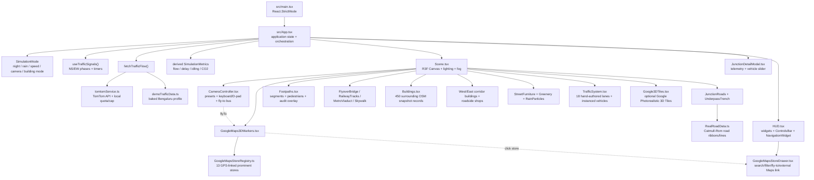
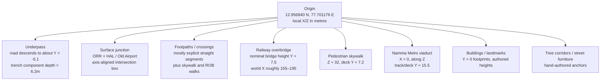
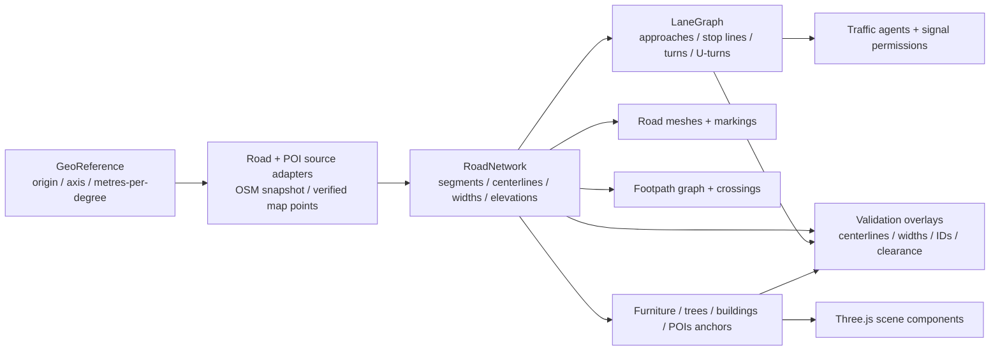

# Marathahalli 3D Simulator — Codebase Context

**Snapshot:** 14 September 2026 · analysis-only pass
**Purpose:** preserve an end-to-end understanding of the current digital-twin prototype before changing its road geometry.

No implementation files were changed during the original analysis pass. Its
browser captures were temporary evidence, not survey-grade validation, and are
not retained in the repository.

## 1. What this project is

The project is a React + Three.js digital-twin-style simulator for the Marathahalli signal junction in Bengaluru. Its intended scene combines:

- a real-world-shaped Outer Ring Road (ORR) / underpass and HAL Old Airport Road corridor;
- surface junction markings, signal infrastructure, ramps, railway/ROB and Namma Metro structures;
- footpaths, skywalk access, pedestrian animation, trees, roadside commerce and prominent landmarks;
- an instanced traffic fleet whose density and movement respond to a signal state machine and a congestion ratio;
- a HUD for modeled telemetry, scene controls, a store/POI explorer and an inspection modal;
- optional TomTom flow data, with a baked demo profile as the safe default;
- optional Google Photorealistic 3D Tiles and a separate Google Maps-linked store registry.

The current product is therefore a **hybrid authored model**: roads and some building records are baked from geographic research, while most visible structures, traffic paths, footpaths, vegetation and furniture are procedural or manually positioned.

## 2. Runtime architecture



### Startup and update flow

1. `main.tsx` mounts `App`.
2. `App` starts in day, clear weather, 1× speed, 1,400 vehicles, overview camera, OSM buildings, footpath audit off and demo traffic on.
3. The traffic hook advances signal phases every 100 ms, scaled by simulation speed.
4. `fetchTrafficFlow()` immediately returns the baked profile in demo mode. Live mode is opt-in and still falls back to demo data on missing keys, quota cap, timeout or malformed responses.
5. `App` derives HUD/modal numbers from the flow ratio, signal colors and configured vehicle count; these are modeled estimates, not sensor observations.
6. `Scene` renders the persistent environment. `TrafficSystem` updates vehicle transforms in `useFrame`; the camera and post-processing update continuously.
7. Traffic is polled again every 180 seconds. UI interactions update the shared `SimulationMode` state and trigger scene/UI changes.

## 3. Spatial model and scene layers

The geographic origin is declared as **12.956840, 77.701176**, described in the code as the surface crossroads center. The intended local convention is:

```text
X: east  (+) / west (-)
Z: north (+) / south (-)
Y: up
surface road level: approximately Y = 0
```



### Nominal scene inventory

| Layer or asset | Current implementation | Nominal placement / extent |
|---|---|---|
| ORR road | `ORR_CENTERLINE_PTS` + ribbon geometry | baked curved path from roughly `[-112,-381]` to `[35,470]`; service ribbons are lateral offsets |
| HAL / Spice Garden corridor | `HAL_TO_SPICEGARDEN_PTS` + ribbon geometry | baked west-east path from roughly `[-455,-18]` to `[470,-15]` |
| Surface junction | `JunctionRoads.tsx` | roughly 56 m east-west × 42 m north-south box; much of its markings remain axis-aligned |
| Underpass | `UnderpassTrench.tsx` | curved road ribbon; floor reaches about `Y=-5.1`; retaining walls/curbs contain straight sections |
| ROB / railway | `FlyoverBridge.tsx`, `RailwayTracks.tsx` | ROB around world X 155–195; railway group is separately rotated and needs spatial verification |
| Metro | `MetroViaduct.tsx` | center median, approximately X 0, Z -225…205, deck around Y 15.5 |
| Skywalk | `Skywalk.tsx` | spans across ORR near Z 32, deck around Y 7.2 |
| Footpaths | `Footpaths.tsx` | ORR side paths around X ±23.5; HAL/Varthur paths around Z ±13…13.5; additional elevated walks |
| Generic buildings | `Buildings.tsx` | 450 surrounding snapshot records, batched by broad use/material |
| Named landmarks | West/East corridor components + remaining landmark blocks | handmade facades for Brand Factory, Kalamandir, Innovative Multiplex, Krishna properties, jewellery/silk stores and others |
| Traffic fleet | `TrafficSystem.tsx` | 18 authored lane definitions, four instanced vehicle meshes, configured 600–2,200 active vehicles |

## 4. Data provenance and ownership

### Geographic sources

- `marathahalli_osm.xml` is an OSM extract bounded by approximately `12.953…12.961 N` and `77.697…77.706 E`. It contains nodes, ways and relations, including traffic signals, crossings, railway and businesses.
- The XML is **not parsed at runtime**. `RealRoadData.ts` contains baked coordinate arrays described as derived from the extract. This makes the current roads reproducible, but it also means the source-to-model transformation is not inspectable or automatically refreshable in the app.
- `GoogleMapsStoreRegistry.ts` contains 13 manually curated prominent places with latitude/longitude, ratings, addresses and authored dimensions. `gpsTo3D()` converts those GPS values directly into local X/Z metres.
- The Google Maps screenshot in this audit is an external visual reference around the origin. It is not currently a basemap or collision/source layer inside the default scene.

### Renderer ownership

| Concern | Current owner | Important characteristic |
|---|---|---|
| Road surfaces | `JunctionRoads.tsx`, `UnderpassTrench.tsx` | Catmull-Rom ribbons for two corridor centerlines, plus many independent boxes/planes/lines |
| Lane movement | `TrafficSystem.tsx` | separate hand-authored lane paths; mostly straight/constant coordinate corridors |
| Turn behavior | `TrafficSystem.tsx` | four free-left slip paths; no true U-turn route graph |
| Roadside pedestrian space | `Footpaths.tsx` | explicit segments with paved/missing/encroached/metro-blocked visual status |
| Walkability KPI | `HUD.tsx` | hardcoded 54% paved, 26% missing, 20% blocked rather than calculated from segments |
| Buildings | `Buildings.tsx` + west/east handmade modules | generated records are filtered in handcrafted zones and replaced by authored landmarks |
| POI interaction | `GoogleMaps3DMarkers.tsx` + drawer | GPS markers, labels, camera framing and external Maps links |
| Traffic telemetry | `demoTrafficData.ts`, `tomtomService.ts`, `App.tsx` | live/demo values drive HUD estimates; they do not yet drive lane-level demand |
| Visual polish | `PostProcessing.tsx`, `Scene.tsx` | ACES tone mapping, fog, bloom, AO, vignette, rain and day/night lighting |

## 5. Existing functionality

| User control | Effect |
|---|---|
| `OVERVIEW`, `CROSSOVER`, `UNDERPASS` | camera presets for the overall twin and street/underpass inspection |
| landmark presets | frontal camera framing for Brand Factory, Kalamandir, Multiplex and Spice Garden |
| WASD / drag / arrows / Q-E / Shift | camera translation, orbit, tilt, altitude and sprint |
| navigation D-pad | same camera control bus as keyboard input |
| `MAP STORES` | opens the 13-store drawer and enables the 3D GPS marker layer |
| store selection / `FLY TO STORE IN 3D` | selects a POI and sends an explicit camera target through `cameraControlBus` |
| `MAPS` | opens the store's latitude/longitude in Google Maps in a new browser target |
| `AUDIT PATHS` | shows the footpath status overlay and selected path audit styling |
| `OSM 3D TWIN` / Google 3D Tiles | toggles authored/generated buildings versus the optional Google Tiles loader; handmade landmarks remain in the scene |
| day / night / rain | changes lighting, fog, materials, emissive accents and rain particles |
| cinematic | enables camera auto-rotation behavior |
| `1×`, `10×`, `60×` | scales signal timers and traffic simulation time |
| demo/live toggle | switches between baked traffic and opt-in TomTom flow retrieval |
| `INSPECT` / junction beacon | opens the modeled telemetry modal and vehicle-density slider |
| TomTom reset | clears the local usage counter and requests a non-forced live attempt |

The type definitions include additional camera names (`surface`, `aerial`, `ground`, `flyover`), but the normal control bar does not expose all of them. The signal hook also includes all-red transition phases while the public signal type exposes the four main NS/EW green/amber states.

## 6. Visual evidence boundary

The original audit used ephemeral local-app and map captures to identify
occlusion, low-contrast presentation, landmark placement, and the modeled
telemetry contract. Those captures were deliberately removed during handoff;
run the app with `npm run dev` for current visual QA. External map imagery is a
reference only and is not bundled as a basemap or copied asset.

## 7. Highest-risk alignment gaps before the road fix

### P0 — one canonical road network is missing

`RealRoadData.ts` drives the main curved asphalt ribbons, but `TrafficSystem.tsx` defines a second lane system independently. `Footpaths.tsx`, `StreetFurniture.tsx`, many junction markings and parts of `UnderpassTrench.tsx` use a third, mostly axis-aligned coordinate layout. As a result, a road can curve while vehicles, curbs, trees, crossings or lane lines continue along straight coordinates.

This is the central issue to solve before “perfect road” work: the same segment geometry must generate the surface, lane centerlines, shoulders, markings, footpath anchors, turn connectors and traffic paths.

### P0 — turn topology is visual rather than behavioral

The road renderer includes U-turn arrows/markings, but the traffic system has no explicit U-turn connector or movement graph. The four slip lanes are free-left-style paths, not a complete set of legal movements through the junction. Signal stopping is based on a `stopT` value on individual lanes rather than a topology of approaches, stop lines and turn permissions.

### P0 — geographic truth is split between three coordinate sources

The OSM extract, baked road arrays, GPS store conversion and handmade landmark coordinates are not linked by a shared import/validation pipeline. A store marker can be GPS-derived while its corresponding building is manually positioned elsewhere. This is acceptable for a prototype, but it is not enough to guarantee that named buildings are on the correct side of the actual road.

### P1 — curved and straight structure components can disagree

The underpass road follows the curved ORR ribbon, while several retaining-wall, divider, curb and lane-marking pieces are straight. The surface junction is an axis-aligned box around curved approaches. These are likely sources of road-edge gaps, floating vehicles and apparent lane drift.

### P1 — dimensions have duplicated configuration

`location.ts` declares `underpassDepth: 5.2`, while `UnderpassTrench.tsx` uses a 6.2 m component depth and a floor near -5.1 m. Similar hardcoded dimensions exist for roads, paths, furniture and infrastructure. A single dimensional contract is needed before tuning vertical clearance.

### P1 — footpath KPI and geometry are disconnected

Footpath segments have statuses, but the HUD's 54/26/20 percentages are hardcoded. The unused `FootpathWalkabilityMetrics` type suggests the intended next step: calculate coverage and blockage from the segment catalog and show which physical segments produce each metric.

### P1 — authored buildings can dominate the camera and mask the network

The overview/crossover captures show large foreground roof/facade geometry obscuring the junction. This may be a camera framing problem, a building footprint/height problem, or both. It should be measured with a debug bounding-box/visibility overlay rather than fixed by arbitrary camera movement.

### P2 — reproducibility and performance need explicit checks

Traffic starts agents with `Math.random()`, so the exact initial fleet is not repeatable between reloads. Vehicles wrap around lane paths and the gap calculation is local to each loop. The current production build passes, but Vite reports a minified JavaScript chunk around 1.6 MB (about 476 KB gzip); 4096² shadows, many authored meshes and optional tile streaming should be profiled on the target machine.

### P2 — optional Google rendering is not the same as the default model

Google Photorealistic 3D Tiles require `VITE_GOOGLE_MAPS_KEY` and the relevant Google Maps Platform access. The toggle changes the generic building renderer to the tile loader; it does not replace the authored roads, landmarks, traffic, footpaths or infrastructure. The store drawer's Google Maps URLs and the in-scene Google Tiles layer are separate integrations.

## 8. Recommended coding seams for the next phase

The following structure follows the current code without implementing it yet:



Suggested ownership:

- `GeoReference`: one origin, axis direction, conversion constants and optional north/heading metadata.
- `RoadNetwork`: named segments for ORR, HAL, service roads, underpass ramps, surface approaches and ROB/Spice Garden connections; each segment owns a centerline, width, elevation profile and stationing.
- `LaneGraph`: lane centerlines sampled from the road network, stop lines, legal movement connectors, signal groups, turn radius and U-turn rules.
- `SidewalkGraph`: path segments attached to road station ranges, crossings, ramps, obstructions and accessibility state.
- `SceneCatalog`: one record per landmark/building/POI with source coordinates, footprint, height, confidence and renderer choice.
- `ValidationOverlay`: toggles for source points, road centerlines, lane IDs, sidewalk edges, vertical clearances, collision/overlap boxes and camera frustums.

The first implementation should be a data/validation layer plus debug rendering. Once the shared network is visually confirmed against the browser map reference, the existing scene modules can consume it incrementally without needing a full rewrite of the authored facade work.

## 9. Open decisions to resolve before implementation

- What exact corridor is in scope: only the configured OSM bounds, or the wider ORR/HAL/Spice Garden/railway/metro extent shown by the scene?
- Is the authoritative horizontal geometry OSM, Google Maps, a survey/engineering drawing, or a manually reviewed combination?
- Which elements need survey-grade placement: underpass ramps, U-turns, ROB/railway, metro piers, skywalk, store frontages or all of them?
- Which U-turn movements are legal, where are their physical openings, and how should they interact with the signal phases?
- Should generic buildings remain procedural, or should selected buildings be modeled from verified footprints/heights?
- Is Google 3D Tiles an optional visual reference, a production dependency, or only a developer debugging mode?
- What is the target device/frame rate when rendering 1,400–2,200 vehicles and the full environment?

## 10. Verification baseline

- `npm run build` passes (`tsc && vite build`). The build currently reports a large-chunk warning, which is a performance follow-up rather than a compile failure.
- The local app was run through Vite at `http://localhost:5175/` and exercised through overview, crossover, underpass, footpath audit, store drawer, landmark and inspection-modal flows.
- No browser console errors or warnings were observed during those checks.
- Temporary visual evidence from the original audit is not retained; current
  visual QA is performed against the running app.
- The earlier planning notes remain in [`plan-mode/implementation_plan.md`](../plan-mode/implementation_plan.md) and should be treated as historical context to reconcile with the current source, not as a complete description of the current renderer.
